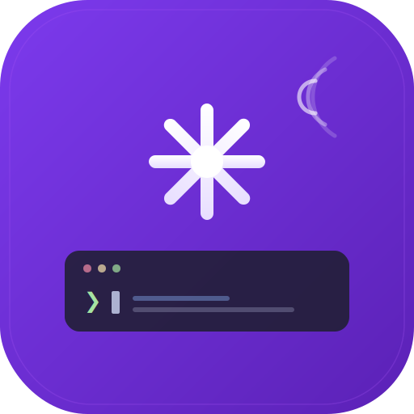

<p align="center">
  <picture>
    <source media="(prefers-color-scheme: dark)" srcset=".github/banner.svg">
    <source media="(prefers-color-scheme: light)" srcset=".github/banner.svg">
    
  </picture>
</p>

<p align="center">
  <strong>SSH into your dev server. Let Claude ship code. From anywhere.</strong>
</p>

<p align="center">
  <a href="https://github.com/Samuele95/claude-carry/releases"></a>
  &nbsp;
  <a href="LICENSE"></a>
  &nbsp;
  <a href="https://github.com/Samuele95/claude-carry/stargazers"></a>
</p>

<p align="center">
  <a href="#-quick-start">Quick Start</a> · <a href="#-demo">Demo</a> · <a href="#-features">Features</a> · <a href="#-build-from-source">Build</a> · <a href="#-contributing">Contributing</a>
</p>

---

<p align="center">
  <a href="https://github.com/Samuele95/claude-carry/releases"></a>
  &nbsp;
  <a href="https://github.com/Samuele95/claude-carry/releases"></a>
  &nbsp;
  <a href="https://github.com/Samuele95/claude-carry/releases"></a>
</p>

<p align="center">
  
</p>

You're on the bus. A deploy is broken. Your laptop is at home.

Claude Carry gives you a full Claude Code terminal over SSH — on your phone, your Linux desktop, or your Windows machine. Connect to your dev server, tell Claude what to fix, and watch it refactor files, write tests, and push commits. No browser, no VPN portal, no forwarded ports. Open the app, pick a server, and you're in.

---

## 🎬 Demo

<p align="center">
  <picture>
    <source media="(prefers-color-scheme: dark)" srcset=".github/demo.svg">
    <source media="(prefers-color-scheme: light)" srcset=".github/demo.svg">
    
  </picture>
</p>

<p align="center"><em>Pick a server. Talk to Claude. Manage files. Three screens on mobile, one window on desktop.</em></p>

---

## ⚡ Quick Start

**1.** Download the latest build from [**Releases**](https://github.com/Samuele95/claude-carry/releases) — APK for Android, tar.gz for Linux, zip for Windows

**2.** Add your server (hostname, port, username, auth method)

**3.** Connect — Claude launches automatically in your configured mode (standard shell, skip permissions, or custom prompt)

```
You: "refactor the auth module to use JWT instead of sessions"

Claude: ✓ Updated lib/auth/service.dart
        ✓ Updated lib/auth/middleware.dart
        ✓ Created lib/auth/jwt_provider.dart
        Done. 3 files changed in 12.4s
```

That's it. You just shipped code from your phone.

---

## 🧰 Features

### Terminal That Doesn't Compromise

Full `xterm`-compatible terminal with a toolbar built for thumbs, not mice.

| | |
|---|---|
| 🎹 **Smart Toolbar** | Arrow keys, Tab, Esc, Ctrl modifier — everything you need, nothing you don't |
| 📋 **Clipboard Paste** | One-tap paste from your clipboard straight into the terminal |
| ⚡ **Command Palette** | Quick-access Claude commands: `/compact`, `/clear`, `/review`, `/cost` |
| 🎨 **Catppuccin Themes** | Mocha (dark), AMOLED black, and Latte (light) — terminal colors follow your app theme |
| 🔤 **JetBrains Mono** | The best monospace font, configurable from 8pt to 24pt |

### Multi-Session, Multi-Server

Work across projects without disconnecting.

| | |
|---|---|
| 📑 **Session Tabs** | Multiple concurrent SSH sessions with a swipeable tab bar |
| 🔄 **Auto-Reconnect** | Drops happen. Claude Carry reconnects with exponential backoff (1s → 16s) |
| 💤 **Wake Lock** | Screen stays on while you're in a session — no accidental disconnects |
| ⚙️ **Claude Modes** | Standard Shell, Skip Permissions, or Custom Prompt per server |

### File Management Built In

No need to `scp` from a separate app.

| | |
|---|---|
| 📂 **Dual-Pane Browser** | Local files on the left, the server on the right |
| ⬆️ **Upload & Download** | Transfer files between devices with progress tracking |
| 📎 **Attach to Terminal** | Upload a file and paste its remote path in one tap |
| 🗂️ **Full CRUD** | Create directories, rename, delete — all from the app |

### Connection That Just Works

| | |
|---|---|
| 🔑 **SSH Key Auth** | Ed25519 keys, auto-generated and stored securely on-device |
| 🔒 **Password Auth** | Encrypted on-device via `flutter_secure_storage` |
| 🛡️ **TOFU Host Keys** | Trust-on-first-use verification — warns you if a server fingerprint changes |
| ✅ **Connection Test** | Verify server connectivity before committing to a session |
| 📝 **Server Profiles** | Save, edit, and manage multiple servers |
| 🏠 **Home Widget** | Quick-prompt widget — fire off a Claude query without even opening the app |

### Desktop

On screens wider than 800px, Claude Carry switches to a three-panel layout: server sidebar on the left, terminal in the center, file browser on the right.

| | |
|---|---|
| 🖥️ **Three-Panel Layout** | Sidebar, terminal, and file panel side by side |
| 📐 **Adaptive Layout** | Automatically switches between mobile and desktop at 800px width |
| 💾 **Window Persistence** | Window size and position are saved between sessions |
| ⌨️ **Keyboard Shortcuts** | Full shortcut set for session and panel management (see below) |

<details>
<summary><strong>⌨️ Keyboard Shortcuts</strong></summary>

| Shortcut | Action |
|---|---|
| `Ctrl+Shift+T` | New session |
| `Ctrl+Shift+W` | Close session |
| `Ctrl+Tab` | Next session |
| `Ctrl+Shift+Tab` | Previous session |
| `Ctrl+Shift+B` | Toggle file panel |
| `Ctrl+Shift+K` | Command palette |
| `Ctrl+Shift+/` | Show keyboard shortcuts |

</details>

---

## 🏗️ Architecture

Three layers. No magic.

```
┌─────────────────────────────────────────────────────────┐
│  UI Layer                  Flutter widgets + Riverpod    │
│  ┌─────────┐ ┌──────────┐ ┌────────┐ ┌───────────────┐ │
│  │Terminal │ │Connection│ │ Files  │ │   Settings    │ │
│  │ Screen  │ │  Screen  │ │ Panel  │ │   Screen      │ │
│  └────┬────┘ └────┬─────┘ └───┬────┘ └───────────────┘ │
├───────┼──────────┼─────────────┼────────────────────────┤
│  Service Layer               Providers + Business Logic  │
│  ┌────┴────┐ ┌───┴────┐ ┌────┴─────┐ ┌──────────────┐  │
│  │  SSH    │ │ Connec-│ │  SFTP    │ │   Profile     │  │
│  │ Service │ │ Manager│ │ Service  │ │   Repository  │  │
│  └────┬────┘ └────┬───┘ └────┬─────┘ └──────────────┘  │
├───────┼───────────┼──────────┼──────────────────────────┤
│  Transport Layer                        dartssh2         │
│           SSH + SFTP over TCP                            │
└─────────────────────────────────────────────────────────┘
```

**State management:** Riverpod — `AsyncNotifier` for profiles, `StreamProvider` for connection state and transfers.

<details>
<summary><strong>📁 Project structure</strong></summary>

```
lib/
├── main.dart                        # Entry point, edge-to-edge
├── app.dart                         # Root widget, routing
├── core/
│   ├── models/                      # ServerProfile, Session, TransferItem
│   ├── providers.dart               # Riverpod wiring
│   ├── ssh/
│   │   ├── ssh_service.dart         # PTY, auto-reconnect, keepalive
│   │   ├── connection_manager.dart  # Multi-session orchestration
│   │   ├── connection_tester.dart   # Pre-connect verification
│   │   └── sftp_service.dart        # Uploads, downloads, progress
│   └── storage/
│       ├── key_manager.dart         # Ed25519 generation & Keystore
│       ├── host_key_store.dart      # TOFU host key verification
│       └── profile_repository.dart  # Encrypted profile CRUD
├── features/
│   ├── connection/                  # Server list, add/edit, key display
│   ├── terminal/                    # Terminal, toolbar, command palette
│   ├── files/                       # Dual-pane local + remote browser
│   ├── settings/                    # Preferences (theme, font, toggles)
│   ├── desktop/                     # Three-panel shell, sidebar, shortcuts
│   └── widget/                      # Home screen quick-prompt
└── theme/
    ├── app_theme.dart               # Material 3 definitions
    └── terminal_theme.dart          # Catppuccin dark, amoled, light
```

</details>

---

## 🔨 Build from Source

```bash
git clone https://github.com/Samuele95/claude-carry.git
cd claude-carry
flutter pub get

# Android
flutter build apk --release

# Linux
sudo apt-get install -y ninja-build libgtk-3-dev
flutter build linux --release

# Windows (run in PowerShell)
flutter build windows --release
```

**Requirements:** Flutter 3.41+ · Dart 3.11+ · Java 21 (for Android builds)

---

## 🤝 Contributing

We'd love your help. Whether it's a bug fix, new feature, screenshots, or just better docs — every contribution matters.

<p>
  
</p>

1. Read the [**Contributing Guide**](CONTRIBUTING.md)
2. Check the [**open issues**](https://github.com/Samuele95/claude-carry/issues)
3. Fork, branch, code, PR

<details>
<summary><strong>Ideas for contributions</strong></summary>

- 📸 **Screenshots & screen recordings** for the README
- 🌍 **Internationalization** — translations welcome
- ♿ **Accessibility** — screen reader support, contrast
- 🍎 **iOS port** — Flutter makes this straightforward
- 🧪 **More tests** — always room for better coverage

</details>

---

## 📦 Dependencies

| Package | What it does |
|---|---|
| [`dartssh2`](https://pub.dev/packages/dartssh2) | SSH/SFTP client |
| [`xterm`](https://pub.dev/packages/xterm) | Terminal emulator |
| [`flutter_riverpod`](https://pub.dev/packages/flutter_riverpod) | State management |
| [`flutter_secure_storage`](https://pub.dev/packages/flutter_secure_storage) | Encrypted credentials |
| [`wakelock_plus`](https://pub.dev/packages/wakelock_plus) | Screen wake lock |
| [`pinenacl`](https://pub.dev/packages/pinenacl) | Ed25519 keys |
| [`home_widget`](https://pub.dev/packages/home_widget) | Home screen widget |
| [`file_picker`](https://pub.dev/packages/file_picker) | File selection |

---

<p align="center">
  <strong>If Claude Carry saved you a trip to your desk, consider leaving a ⭐</strong>
</p>

<p align="center">
  <a href="LICENSE">MIT License</a> · Made with 🤖 + ☕
</p>
