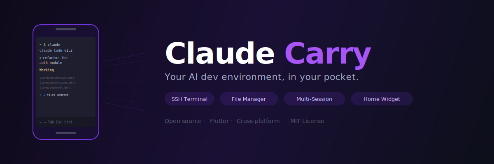
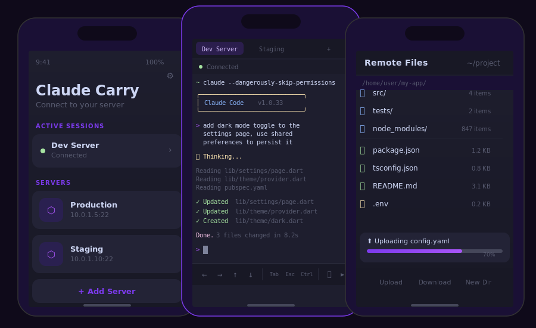

<p align="center">
  <picture>
    <source media="(prefers-color-scheme: dark)" srcset=".github/banner.svg">
    <source media="(prefers-color-scheme: light)" srcset=".github/banner.svg">
    
  </picture>
</p>

<p align="center">
  <strong>Your AI dev environment, in your pocket.</strong>
</p>

<p align="center">
  <a href="https://github.com/Samuele95/claude-mobile/releases"></a>
  &nbsp;
  <a href="https://github.com/Samuele95/claude-mobile/actions/workflows/ci.yml"></a>
  &nbsp;
  <a href="LICENSE"></a>
  &nbsp;
  <a href="https://github.com/Samuele95/claude-mobile/stargazers"></a>
</p>

<p align="center">
  <a href="#-quick-start">Quick Start</a> · <a href="#-demo">Demo</a> · <a href="#-features">Features</a> · <a href="#-build-from-source">Build</a> · <a href="#-contributing">Contributing</a>
</p>

---

Claude Carry turns your Android phone into a remote Claude Code terminal. SSH into your dev server from anywhere — the couch, the bus, the coffee shop — and let Claude refactor your codebase, write tests, or debug that production issue while you're away from your desk.

No browser. No VPN portal. Just open the app, tap a server, and you're in.

---

## 🎬 Demo

<p align="center">
  <picture>
    <source media="(prefers-color-scheme: dark)" srcset=".github/demo.svg">
    <source media="(prefers-color-scheme: light)" srcset=".github/demo.svg">
    
  </picture>
</p>

<p align="center"><em>Three screens. That's all it takes. Pick a server, talk to Claude, manage files.</em></p>

---

## ⚡ Quick Start

**1.** Grab the APK from [**Releases**](https://github.com/Samuele95/claude-mobile/releases) and install it

**2.** Add your server (hostname, port, username, auth method)

**3.** Tap to connect — Claude launches automatically

```
You: "refactor the auth module to use JWT instead of sessions"

Claude: ✓ Updated lib/auth/service.dart
        ✓ Updated lib/auth/middleware.dart
        ✓ Created lib/auth/jwt_provider.dart
        Done. 3 files changed in 12.4s
```

That's it. You just shipped code from your phone.

---

## 🧰 Features

### Terminal That Doesn't Compromise

Full `xterm`-compatible terminal with a toolbar built for thumbs, not mice.

| | |
|---|---|
| 🎹 **Smart Toolbar** | Arrow keys, Tab, Esc, Ctrl modifier — everything you need, nothing you don't |
| 📋 **Clipboard Paste** | One-tap paste from your clipboard straight into the terminal |
| ⚡ **Command Palette** | Quick-access Claude commands: `/compact`, `/clear`, `/review`, `/cost` |
| 🎨 **Catppuccin Themes** | Mocha (dark), AMOLED black, and Latte (light) — terminal colors follow your app theme |
| 🔤 **JetBrains Mono** | The best monospace font, configurable from 8pt to 24pt |

### Multi-Session, Multi-Server

Work across projects without disconnecting.

| | |
|---|---|
| 📑 **Session Tabs** | Multiple concurrent SSH sessions with a swipeable tab bar |
| 🔄 **Auto-Reconnect** | Drops happen. Claude Carry reconnects with exponential backoff (1s → 16s) |
| 💤 **Wake Lock** | Screen stays on while you're in a session — no accidental disconnects |
| ⚙️ **Claude Modes** | Standard Shell, Skip Permissions, or Custom Prompt per server |

### File Management Built In

No need to `scp` from a separate app.

| | |
|---|---|
| 📂 **Dual-Pane Browser** | Your phone's files on the left, the server on the right |
| ⬆️ **Upload & Download** | Transfer files between devices with progress tracking |
| 📎 **Attach to Terminal** | Upload a file and paste its remote path in one tap |
| 🗂️ **Full CRUD** | Create directories, rename, delete — all from your phone |

### Connection That Just Works

| | |
|---|---|
| 🔑 **SSH Key Auth** | Ed25519 keys, auto-generated and stored in the Android Keystore |
| 🔒 **Password Auth** | Encrypted on-device via `flutter_secure_storage` |
| 📝 **Server Profiles** | Save, edit, and manage multiple servers |
| 🏠 **Home Widget** | Quick-prompt widget — fire off a Claude query without even opening the app |

---

## 🏗️ Architecture

Three layers. No magic.

```
┌─────────────────────────────────────────────────────────┐
│  UI Layer                  Flutter widgets + Riverpod    │
│  ┌─────────┐ ┌──────────┐ ┌────────┐ ┌───────────────┐ │
│  │Terminal │ │Connection│ │ Files  │ │   Settings    │ │
│  │ Screen  │ │  Screen  │ │ Panel  │ │   Screen      │ │
│  └────┬────┘ └────┬─────┘ └───┬────┘ └───────────────┘ │
├───────┼──────────┼─────────────┼────────────────────────┤
│  Service Layer               Providers + Business Logic  │
│  ┌────┴────┐ ┌───┴────┐ ┌────┴─────┐ ┌──────────────┐  │
│  │  SSH    │ │ Connec-│ │  SFTP    │ │   Profile     │  │
│  │ Service │ │ Manager│ │ Service  │ │   Repository  │  │
│  └────┬────┘ └────┬───┘ └────┬─────┘ └──────────────┘  │
├───────┼───────────┼──────────┼──────────────────────────┤
│  Transport Layer                        dartssh2         │
│           SSH + SFTP over TCP                            │
└─────────────────────────────────────────────────────────┘
```

**State management:** Riverpod — `AsyncNotifier` for profiles, `StreamProvider` for connection state and transfers.

<details>
<summary><strong>📁 Project structure</strong></summary>

```
lib/
├── main.dart                        # Entry point, edge-to-edge
├── app.dart                         # Root widget, routing
├── core/
│   ├── models/                      # ServerProfile, Session, TransferItem
│   ├── providers.dart               # Riverpod wiring
│   ├── ssh/
│   │   ├── ssh_service.dart         # PTY, auto-reconnect, keepalive
│   │   ├── connection_manager.dart  # Multi-session orchestration
│   │   └── sftp_service.dart        # Uploads, downloads, progress
│   └── storage/
│       ├── key_manager.dart         # Ed25519 generation & Keystore
│       └── profile_repository.dart  # Encrypted profile CRUD
├── features/
│   ├── connection/                  # Server list, add/edit, key display
│   ├── terminal/                    # Terminal, toolbar, command palette
│   ├── files/                       # Dual-pane local + remote browser
│   ├── settings/                    # Preferences (theme, font, toggles)
│   └── widget/                      # Home screen quick-prompt
└── theme/
    ├── app_theme.dart               # Material 3 definitions
    └── terminal_theme.dart          # Catppuccin dark, amoled, light
```

</details>

---

## 🔨 Build from Source

```bash
git clone https://github.com/Samuele95/claude-mobile.git
cd claude-mobile
flutter pub get
flutter build apk --debug     # or --release
```

**Requirements:** Flutter 3.41+ · Dart 3.11+ · Java 21 · Android SDK 35

---

## 🤝 Contributing

We'd love your help. Whether it's a bug fix, new feature, screenshots, or just better docs — every contribution matters.

1. Read the [**Contributing Guide**](CONTRIBUTING.md)
2. Check the [**open issues**](https://github.com/Samuele95/claude-mobile/issues)
3. Fork, branch, code, PR

<details>
<summary><strong>Ideas for contributions</strong></summary>

- 📸 **Screenshots & screen recordings** for the README
- 🧪 **Unit and widget tests** — coverage is low
- 🌍 **Internationalization** — translations welcome
- ♿ **Accessibility** — screen reader support, contrast
- 🍎 **iOS port** — the architecture is platform-agnostic

</details>

---

## 📦 Dependencies

| Package | What it does |
|---|---|
| [`dartssh2`](https://pub.dev/packages/dartssh2) | SSH/SFTP client |
| [`xterm`](https://pub.dev/packages/xterm) | Terminal emulator |
| [`flutter_riverpod`](https://pub.dev/packages/flutter_riverpod) | State management |
| [`flutter_secure_storage`](https://pub.dev/packages/flutter_secure_storage) | Encrypted credentials |
| [`wakelock_plus`](https://pub.dev/packages/wakelock_plus) | Screen wake lock |
| [`pinenacl`](https://pub.dev/packages/pinenacl) | Ed25519 keys |
| [`home_widget`](https://pub.dev/packages/home_widget) | Home screen widget |
| [`file_picker`](https://pub.dev/packages/file_picker) | File selection |

---

<p align="center">
  <strong>If Claude Carry saved you a trip to your desk, consider leaving a ⭐</strong>
</p>

<p align="center">
  <a href="LICENSE">MIT License</a> · Made with 🤖 + ☕
</p>
